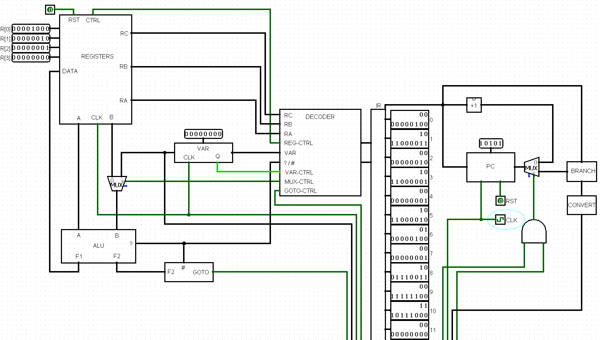
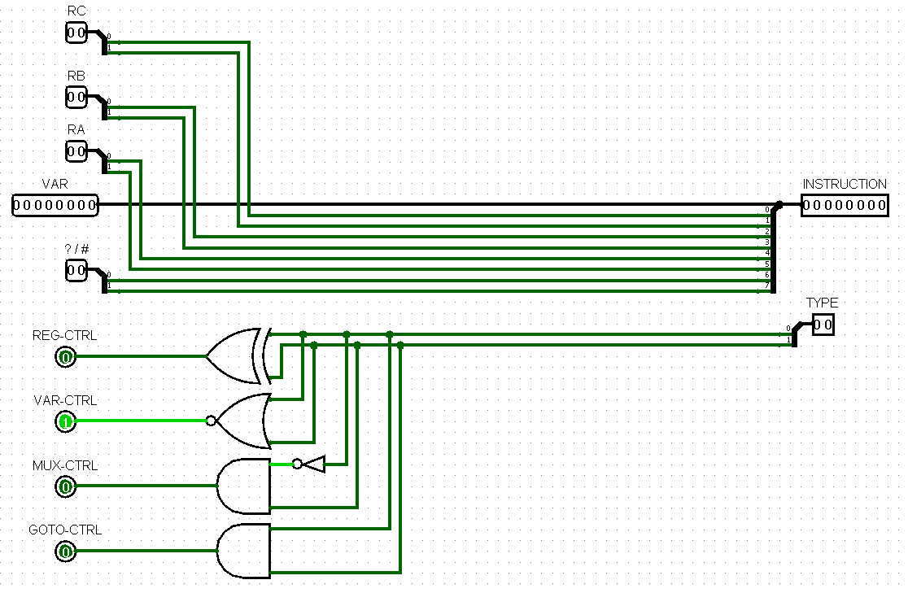
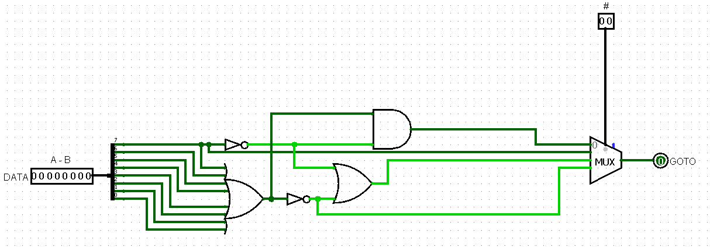
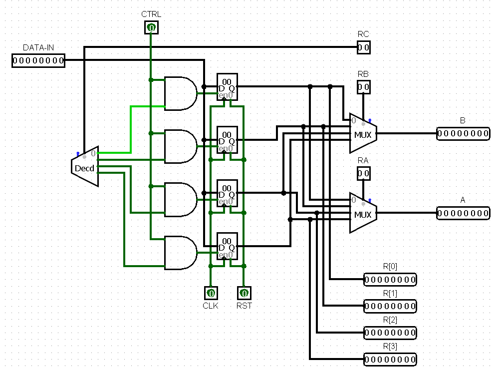
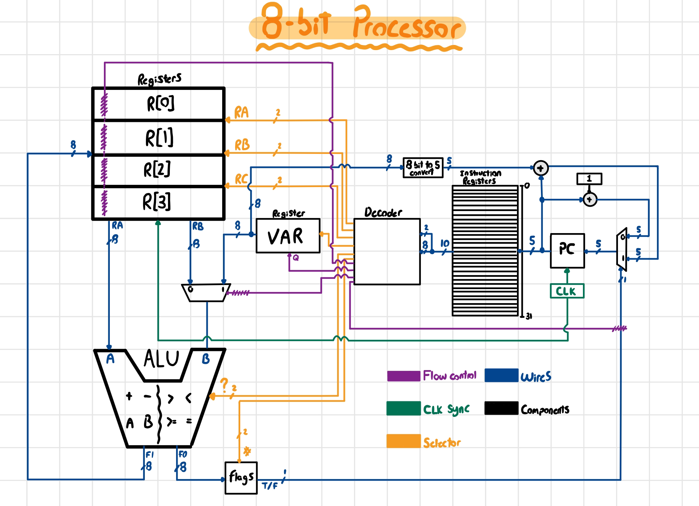

# 8-bit CPU

## Overview

This project involves designing an 8-bit CPU from scratch. The design process began with creating a manual design, followed by defining the instruction set and bit responsibilities. I then developed individual components using Logisim, such as the adder, subtractor, ALU, and registers. The final integration included building a decoder for instructions and a program counter (PC) to execute instructions sequentially.

## 🌟 Features

- **4 Registers**: The CPU contains four registers for storing data temporarily.
- **8 ALU Operations**: Supports eight arithmetic and logical operations to handle various computations.
- **Assembly coding**: Assembly examples.xlsx demonstrates the CPU’s capabilities with assembly code for multiplication and modulo operations, converted into 10-bit instructions.

## 📸 Project Screenshots

### CPU 


### Decoder


### Flags decoder


### Registers


### Handmade sketch


## 🚀 Installation and Setup

To set up the project on your local machine, follow these steps:

1. **Clone the repository**

2. **Install Logisim**:
   ```sh
   Download Logisim from [Logisim SourceForge] (https://sourceforge.net/projects/circuit/).
3. **Download the Latest Version of Java**:
   ```sh
   You can download it from Java [Downloads](https://www.oracle.com/java/technologies/downloads/#java11)
4. **Open Logisim**:
   ```sh
   file > open > CPU.circ
   
## 🛠️Technologies Used

- **Logisim**: A graphical tool for designing and simulating digital circuits.
- **Exel** : Used for containing instruction information and simulating assembly.
